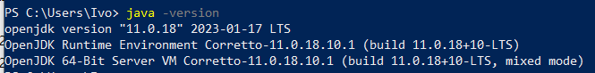
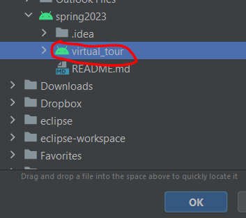
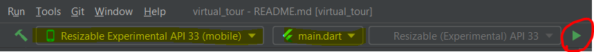

# Spring 2023 - The best cohort ever.

Enable a deeper connection between the user and the facility by providing a virtual tour experience that enables text searchable elements.

Cohort Spring 2023 - Demo Checkin - Merge Conflict

# Windows PC Setup

## 1. Download and extract flutter zip file to C:\src\flutter

https://docs.flutter.dev/get-started/install/windows


## 2. Install Android Studio

https://developer.android.com/studio

## 3. Install Java 11 jdk

https://docs.aws.amazon.com/corretto/latest/corretto-11-ug/windows-7-install.html

Ensure JAVA_HOME is set properly



## 4. Import the project





## 5. Launching the android application

Create an emulator and run "main.dart"


## 6. Launching the web application

From command line

```
flutter run -d chrome
```