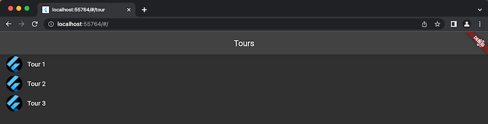

# Spring 2023 - The best cohort ever.

Enable a deeper connection between the user and the facility by providing a virtual tour experience
that enables text searchable elements.

Cohort Spring 2023 - Demo Checkin - Merge Conflict

## Flutter App

- Follow [Flutter docs](https://docs.flutter.dev/get-started/install) to install required apps and
  set up your local environment.
- Clone this repo:
    ```
    git clone https://github.com/umgc/spring2023.git
    ```
- Try the app:
    ```
    cd spring2023
    git checkout viet/prototype
    cd virotour
    flutter run -d chrome
    ```
- You should see this

<div style='float: center'>
    </img>
</div>
<div style='float: center'>
    </img>
</div>
- ⚠️ At the moment, everything is hard coded. This is just a hacky solution. All 3 tours are the same. Each tour only shows one 360 image that Hang Wang took.
