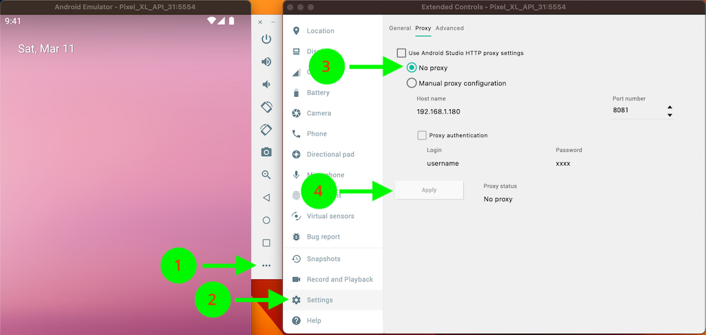

# Android Issues

## SocketException: OS Error: Connection refused

- With your android emulator open, select the 3 dots on the right vertical menu. 
- Select **Settings** > **Proxy**
- Uncheck **Use Android Studio HTTP proxy settings**
- Check **No proxy**
- Click **Apply**

    

