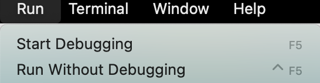

# MacOS Setup

1. Follow [Flutter docs](https://docs.flutter.dev/get-started/install) to install required apps and set up your local environment.
1. Clone this repo:
    ```
    git clone https://github.com/umgc/spring2023.git
    cd spring2023
    git checkout joint_dev
    code virotour/lib/main.dart
    ```
1. Watch [this video](https://www.youtube.com/watch?v=ZSWfgxrxN0M) to install required apps for different platforms (Windows, MacOS, iOS, Android).
1. Assuming you didn't get any issues and you're using a Macbook and VSCode, while you have the `main.dart` open, use VSCode's Command Palette (`cmd+shift+P`), type or select: `Flutter: Select Device`. You should see this:

    <div style='float: center'>
        </img>
    </div>

1. Select the device you want to test this app on.
1. Go to VSCode > Run > Start Debugging. Ignore all warnings.

    <div style='float: center'>
        </img>
    </div>

1. You should see this:
    TODO