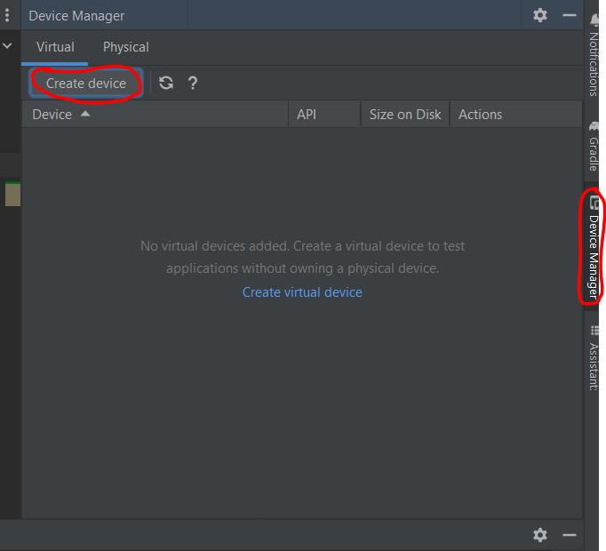
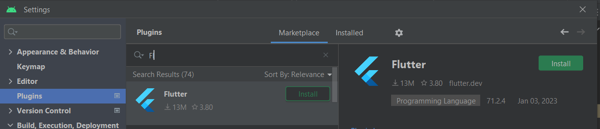

# Windows PC Setup

## 1. Download and extract flutter zip file to C:\src\flutter

https://docs.flutter.dev/get-started/install/windows


## 2. Install Android Studio

https://developer.android.com/studio

## 3. Install Java 11 jdk

https://docs.aws.amazon.com/corretto/latest/corretto-11-ug/windows-7-install.html

Ensure JAVA_HOME is set properly (close all open cmd prompts after setting to see update)

java -version
openjdk version "11.0.18" 2023-01-17 LTS
OpenJDK Runtime Environment Corretto-11.0.18.10.1 (build 11.0.18+10-LTS)
OpenJDK 64-Bit Server VM Corretto-11.0.18.10.1 (build 11.0.18+10-LTS, mixed mode)

## 4. Import the project






## 5. Launching the android application

Create an emulator and run "main.dart"


## 6. Launching the web application

From command line

```
flutter run -d chrome
```
